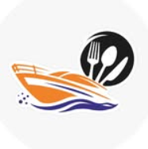

# 💨 Boat & Bites Restaurant — Gujarat's First Cruise Theme Dining

<p align="center">
  
</p>

<p align="center">
  <strong>Gujarat's First Cruise & Boat Theme Pure Vegetarian Restaurant</strong><br>
  <em>"This boat doesn't move, but the food will move you."</em>
</p>

---

## 🍊 About The Project

**Boat & Bites** is an immersive, mobile-first web application engineered for Surat's premier cruise and boat-themed multi-cuisine pure vegetarian dining destination at Anthem Circle.

---

## ✓ Key Features

- **⒈ 5-Second Cruise Card Carousel**: Die-cut cruise-boat shaped menu cards with infinite looping, smooth touch swipes, and a fullscreen zoom & pan lightbox modal (`object-contain`).
- **┐ Searchable Directory**: Comprehensive directory with live instant search across English and Gujarati titles, category dropdown jump, and touch-friendly filter chips.
- **见 Brand Splash Screen**: Polished entrance loading sequence featuring the official Boat & Bites logo medallion, animated nautical wave line, and tagline.
- **p��� 100%+jjb�X���^��'�+�*#: Single-line header, touch targets >= 48px, slide-over drawer, one-tap calling (`+91 99746 15111`), and zero horizontal overflow.
- **p��� Dual-Row Continuous Gallery**: Infinite continuous marquee with top row sliding right and bottom row sliding left, featuring 12 authentic dining moments.
- **🎉 Viewport-Aware Reels**: Smart autoplay/pause video feeds from Instagram (@boatandbites_surat) with view counters and authentic captions.
- **p��� Grand Banquet & Lawn Venues**: Dedicated showcases for indoor banquet hall (300–600 guests) and outdoor lawn venue (700–1,000+ guests).
- **✅ 100% Verified Restaurant Facts**: Zero fabricated information — authentic timings, pricing, location, and contact numbers.

---

## 📠 Tech Stack

- m*Framework**: React 18 + TypeScript
- **Bundler & Dev Server**: Vite 6
- **Styling**: Tailwind CSS
- **Animations**: Framer Motion
- **Icons**: Lucide React

---

## 📀 Getting Started

X``bash
# install dependencies npm install

# Start development server
npm run dev

# Build for production
npm run build
```

---

## 👍 Restaurant Details

- **Location**: Anthem Circle, New Outer Ring Road, Saniya Hemad / Valak, Surat, Gujarat 395006
- **Contact numbers**: +91 99746 15111 | +91 99258 92727
- **Instagram**: [@boatandbites_surat](https://www.instagram.com/boatandbites_surat/)
- **Timings**: Lunch: 11:00 AM – 3:00 PM | Dinner: 6:30 PM – 11:00 PM
- **Special Feast**: Unlimited Lunch Feast @ ₹350/-
